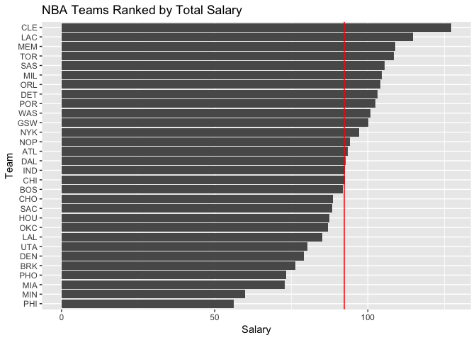
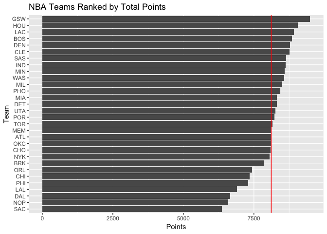
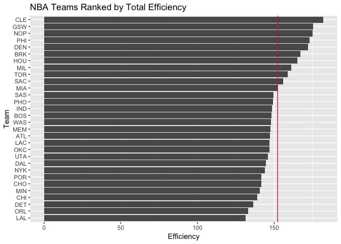
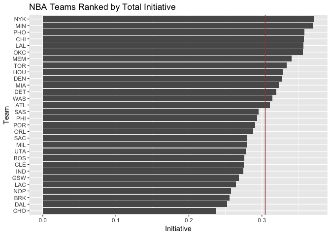

workout01-jiahe-fan
================
Jiahe Fan
10/3/2018

``` r
library(readr)
library(dplyr)  
```

    ## 
    ## Attaching package: 'dplyr'

    ## The following objects are masked from 'package:stats':
    ## 
    ##     filter, lag

    ## The following objects are masked from 'package:base':
    ## 
    ##     intersect, setdiff, setequal, union

``` r
library(ggplot2)
dat <- read_csv('../data/nba2018-teams.csv')
```

    ## Parsed with column specification:
    ## cols(
    ##   team = col_character(),
    ##   experience = col_integer(),
    ##   salary = col_double(),
    ##   points3 = col_integer(),
    ##   points2 = col_integer(),
    ##   points1 = col_integer(),
    ##   points = col_integer(),
    ##   off_rebounds = col_integer(),
    ##   def_rebounds = col_integer(),
    ##   assists = col_integer(),
    ##   steals = col_integer(),
    ##   blocks = col_integer(),
    ##   fouls = col_integer(),
    ##   turnovers = col_integer(),
    ##   efficiency = col_double(),
    ##   init = col_double()
    ## )

Salary decreasingly

``` r
ggplot(dat, aes(reorder(team, salary), salary)) + 
  geom_bar(stat = 'identity') + 
  xlab("Team") + ylab("Salary") + 
  coord_flip() + 
  geom_hline(aes(yintercept = mean(salary)), color = "red") + 
  ggtitle("NBA Teams Ranked by Total Salary")
```



Total points decreasingly

``` r
ggplot(dat, aes(reorder(team, points), points)) + 
  geom_bar(stat = 'identity') + 
  xlab("Team") + ylab("Points") + 
  coord_flip() + 
  geom_hline(aes(yintercept = mean(points)), color = "red") + 
  ggtitle("NBA Teams Ranked by Total Points")
```



Total efficiency decreasingly

``` r
ggplot(dat, aes(reorder(team, efficiency), efficiency)) + 
  geom_bar(stat = 'identity') + 
  xlab("Team") + ylab("Efficiency") + 
  coord_flip() + 
  geom_hline(aes(yintercept = mean(efficiency)), color = "red") + 
  ggtitle("NBA Teams Ranked by Total Efficiency")
```



Own Index: total initiative

``` r
dat <- mutate(dat, init = (off_rebounds / def_rebounds))
summary(dat$init)
```

    ##    Min. 1st Qu.  Median    Mean 3rd Qu.    Max. 
    ##  0.2375  0.2752  0.2944  0.3045  0.3327  0.3711

``` r
write_csv(dat, "../data/nba2018-teams.csv")
```

Plot

``` r
ggplot(dat, aes(reorder(team, init), init)) + 
  geom_bar(stat = 'identity') + 
  xlab("Team") + ylab("Initiative") + 
  coord_flip() + 
  geom_hline(aes(yintercept = mean(init)), color = "red") + 
  ggtitle("NBA Teams Ranked by Total Initiative")
```



Comments and reflections

Was this your first time working on a project with such file structure? If yes, how do you feel about it?

Yes. Very structured. And I feel like 'working out' finally it's nice

Was this your first time using relative paths? If yes, can you tell why they are important for reproducibility purposes?

Yes. I got stuck on the working directory thing in R script once, but I think figuring out is really important.

Was this your first time using an R script? If yes, what do you think about just writing code (without markdown syntax)?

Yes. It's pure and neat. You can still write the comments with pound sign so I think it's as convinient as rmd

What things were hard, even though you saw them in class/lab?

The working directory and stuff...

What was easy(-ish) even though we haven’t done it in class/lab?

plotting! Love plotting

Did anyone help you completing the assignment? If so, who?

yes, I seeked help from my friend in class when I couldn't debug

How much time did it take to complete this HW?

Approximatly 8 hours

What was the most time consuming part?

debugging

Was there anything interesting?

Sense of Accomplishment?lol
